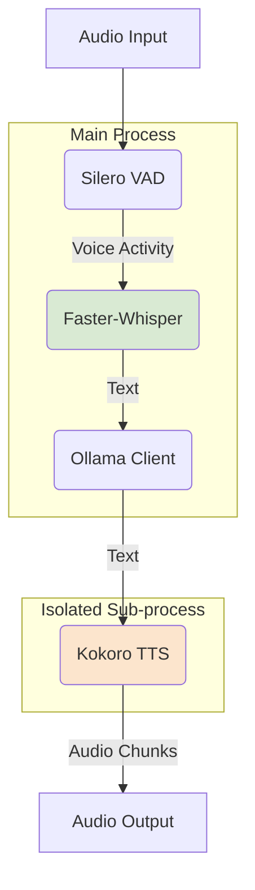

# 2. Architecture

This document provides a high-level overview of the Voice Pipeline's architecture, detailing the flow of data from audio input to audio output.

## System Diagram

The pipeline is built using the `pipecat-ai` framework and orchestrates several services to create a real-time conversational loop.

## Data Flow

The pipeline processes audio in the following sequence:

1.  **Audio Input & VAD (Voice Activity Detection)**
    *   The system ingests raw audio from the user's microphone.
    *   The `pipecat` `SileroVAD` service monitors the audio stream. When it detects the start of speech, it begins buffering frames. When speech ends, it passes the complete utterance to the next stage.

2.  **STT (Speech-to-Text)**
    *   The buffered audio is sent to the `FasterWhisperSTTService`.
    *   This service uses the `distil-medium-en` model running on the CUDA device to transcribe the audio into text with a temperature of `0`.
    *   The resulting text is passed to the language model.

3.  **LLM (Large Language Model)**
    *   The transcribed text is sent as a prompt to the `Ollama` service.
    *   The service makes an HTTP request to the locally running Ollama server, which hosts the `llama3-8b` model.
    *   The LLM generates a text response.

4.  **TTS (Text-to-Speech)**
    *   The LLM's response is streamed to the `KokoroSubprocessTTSService`.
    *   This service is a wrapper that communicates with the Kokoro TTS engine running in an isolated sub-process. This critical design choice prevents dependency conflicts.
    *   For more details, see [3. TTS Service](./3_tts_service.md).

5.  **Audio Output**
    *   The TTS service generates audio chunks, which are immediately sent to the output device (e.g., the user's speakers), providing a low-latency, audible response.
    *   The pipeline is interruptible, meaning the user can begin speaking at any time to stop the audio output and start a new turn. 