# 2. Architecture

## System Overview

The voice pipeline creates a real-time conversational AI using a cascading architecture of open-source, locally-hosted models. This design was chosen for its flexibility, VRAM efficiency, and ability to run on consumer-grade hardware like the NVIDIA L4 GPU.

```mermaid
graph LR
    A[🎙️ Audio Input] --> B[🔍 Silero VAD]
    B --> C[🗣️ Faster Whisper ASR]
    C --> D[🧠 Ollama LLM]
    D --> E[🔊 Kokoro TTS]
    E --> F[🔊 Audio Output]
    
    subgraph "🐳 Docker Container on Runpod (NVIDIA L4 GPU)"
        direction LR
        I[🚀 Pipecat Pipeline]
        I -- orchestrates --> B
        I -- orchestrates --> C
        I -- orchestrates --> D
        I -- orchestrates --> E
    end

    G[🌐 WebSocket Client] <--> I
```



## Data Flow & Components

### 1. Audio Input & VAD
- **Component**: `SileroVADAnalyzer` from Pipecat.
- **Purpose**: Detects the start and end of speech with low CPU overhead, triggering the pipeline. It's configured for responsiveness in a conversational setting.

### 2. Speech-to-Text (ASR)
- **Component**: `WhisperSTTService` (using Faster Whisper).
- **Model**: `distil-medium-en` on CUDA, providing a strong balance of speed and accuracy.
- **Temperature**: Set to `0` for deterministic, repeatable transcriptions.

### 3. Language Model (LLM)
- **Component**: `OLLamaLLMService`.
- **Model**: `Llama-3.1-8B` (quantized), served via a local Ollama instance.
- **Function**: Manages conversation history and generates responses for the coaching avatar.

### 4. Text-to-Speech (TTS)
- **Component**: Custom `KokoroSubprocessTTSService`.
- **Reason**: Kokoro TTS runs in a separate, isolated subprocess. This is a **critical design choice** to resolve conflicting `onnxruntime-gpu` dependencies between the ASR and TTS models, allowing both to run on the GPU.
- **Performance**: This architecture makes Kokoro TTS ~30x faster than running on CPU.

## Key Design Decisions

### Cascading vs. End-to-End
The project initially explored end-to-end models like **Ultravox**. While promising for latency, Ultravox proved immature, lacking essential features like context management and tool-calling. A cascading pipeline was chosen because it offers:
- **Greater Control**: Each component (ASR, LLM, TTS) can be swapped and optimized independently.
- **Better Feature Support**: Easily supports conversation history and system prompts.
- **VRAM Efficiency**: The final pipeline uses **~12GB of VRAM**, compared to Ultravox's **20GB**, making it viable for the target NVIDIA L4/A10 hardware.

### Subprocess Isolation for TTS
A major challenge was the dependency conflict between `onnxruntime-gpu` required by different models. The final solution—running Kokoro TTS in its own subprocess with a separate Python environment—was the key to unlocking full GPU acceleration for the entire pipeline and achieving low latency.

### Local-First, Open-Source Models
A core requirement is to run entirely air-gapped on local hardware. This ensures data privacy for training and eliminates reliance on external APIs. Every model was selected based on its open-source availability and performance on consumer-grade GPUs.

## Performance
- **End-to-End Latency**: **~1.1 seconds** over an internet connection, which is on par with the initial Ultravox target and suitable for real-time conversation.
- **Hardware Target**: Optimized for an **NVIDIA L4 GPU** on Runpod, demonstrating feasibility on accessible hardware.

## Deployment
- **Containerization**: The entire pipeline is containerized with **Docker**, using a `CUDA 12 + cuDNN 9` base image for reproducibility and simplifying dependency management.
- **Platform**: Deployed on **Runpod**, which provides on-demand GPU resources suitable for development and testing.

## Pipeline Configuration

```python
# Key settings in pipecat_pipeline.py
VAD_PARAMS = {
    "min_silence_ms": 200,    # [TO BE ADDED] - Why this value?
    "speech_pad_ms": 120,     # [TO BE ADDED] - Why this value?
    "window_ms": 160          # [TO BE ADDED] - Why this value?
}

PIPELINE_PARAMS = {
    "allow_interruptions": True,
    "enable_metrics": True,
    "enable_tracing": True
}
```

## Deployment Architecture

```
Client (Browser) ←→ WebSocket ←→ FastAPI ←→ Pipecat Pipeline
                                    ↓
                              Docker Container
                              (GPU-enabled)
```

### Components
1. **FastAPI Server** (`main.py`) - WebSocket endpoint and routing
2. **Pipecat Pipeline** (`pipecat_pipeline.py`) - AI service orchestration
3. **Kokoro Wrapper** (`kokoro/tts_subprocess_wrapper.py`) - TTS service
4. **Web Client** (`client/websocket-client/`) - Browser interface

## Performance Targets

**Current Metrics**: [TO BE ADDED]
- End-to-end latency: ___ ms
- VAD detection time: ___ ms
- STT processing time: ___ ms
- LLM response time: ___ ms
- TTS generation time: ___ ms

**Resource Requirements**: [TO BE ADDED]
- Minimum GPU: ___ GB VRAM
- Recommended GPU: ___ GB VRAM
- CPU requirements: ___ cores
- Memory requirements: ___ GB RAM

## Error Handling

- **VAD failures**: [TO BE ADDED] - How do you handle false positives/negatives?
- **STT errors**: [TO BE ADDED] - What happens on transcription failure?
- **LLM timeouts**: [TO BE ADDED] - How do you handle slow responses?
- **TTS failures**: [TO BE ADDED] - What's the fallback for TTS issues?

---

**Next**: Read [Model Decisions](./3_model_decisions.md) to understand why these specific technologies were chosen. 